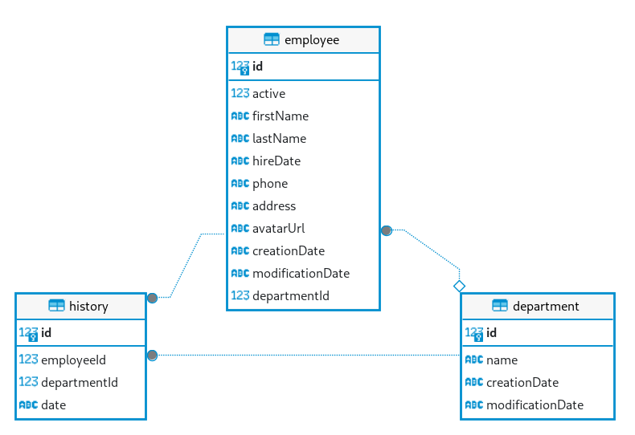

# sem.backend

## Quick start

1. Create a new dabase (named *wsample*) and execute the scripts located under the **scripts/** folder.
   * Run *create_db.sql*

2. Open **wsample.back.sln** on VisualStudio 2022 and run the application!
 

## Features

- DDD-like structure (not purely DDD because of time constraints).
  - Domain events.
  - Mediatr.
- CQRS.
- Lightweight data access using Dapper.
- ViewModels to prevent exposing data from the server.
- Included http examples.
- Sample unit and functional tests.
- Swagger.

## Recommended VSCode extensions

* [SQLite Viewer](https://open-vsx.org/vscode/item?itemName=qwtel.sqlite-viewer) to inspect *sqlite* database files.
* [REST Client](https://open-vsx.org/vscode/item?itemName=humao.rest-client) to run .http files located under *test/* folder
